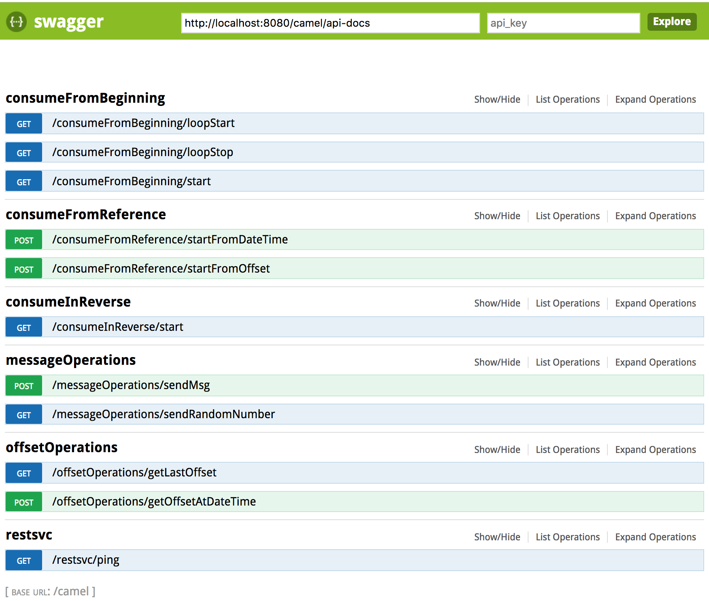
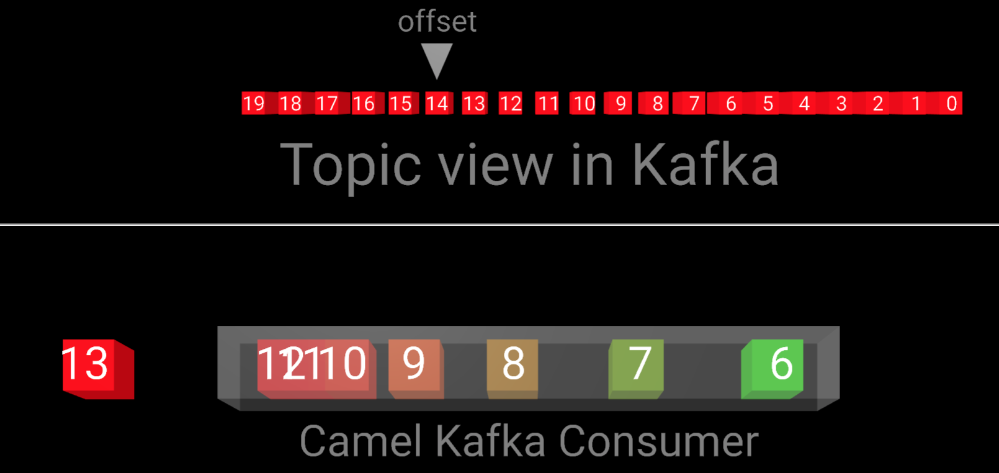

デモ用サンプルアプリ
===========================

このサンプルは、[camel-kafka-vr][1]をベースに少し手直したものです。
[1]: https://gitlab.com/appdev-demos/camel-kafka-vr

このプロジェクトは、Spring-bootベースのCamelサンプルです。

このサンプルでは、Camelを使用してKafkaと連携させ、オフセットを前後に移動する(forward/backward)ことで、さまざまなイベントのリプレイ機能を紹介します。

また、イベントやリプレイを視覚的に表現するために、KafkaトピックおよびCamelコンシューマの3Dビューが組み込まれています。

> Kafka Topicの中身を参照する目的なら、[kafka-topics-ui](/kafka-topics-ui)がお薦めです。

## ローカル環境での実行方法:

前提: Kafkaが予めセットアップ済み

### 1. Create a topic called `my-cluster-test`

	bin/kafka-topics.sh --create --zookeeper localhost:2181 --replication-factor 3 --partitions 1 --topic my-cluster-test

### 2. Run the App

	git clone https://github.com/jian-feng/kafka-topic-viewer
	cd kafka-topic-viewer
	mvn clean package
	java -jar ./target/kafka-topic-viewer-0.1-SNAPSHOT.jar

> Kafka Brokerの情報を上書きしたい場合は、  
`java -jar ./target/kafka-topic-viewer-0.1-SNAPSHOT.jar --kafka.broker=192.168.33.71:9092`

### 3. View REST operations with swagger UI    

[http://localhost:8080/webjars/swagger-ui/2.1.0/index.html?url=/camel/api-docs#](http://localhost:8080/webjars/swagger-ui/2.1.0/index.html?url=/camel/api-docs#)

### 4. Graphical view

[http://localhost:8290/](http://localhost:8290/)    
  or  
[http://localhost:8290/topicview.html](http://localhost:8290/topicview.html)

### 5. To clean topic, delete and recreate with no consumers running

	bin/kafka-topics.sh --zookeeper localhost:2181 --delete --topic my-cluster-test
